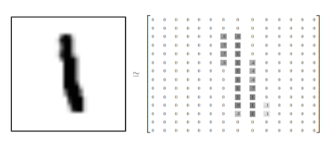
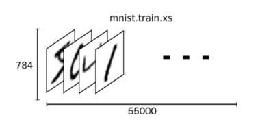
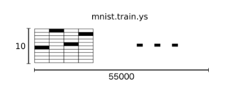
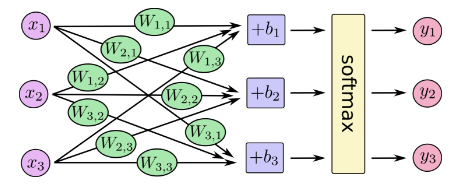

# 基本情况
## 基本声明
此为依据tensorflow的官方文档进行的tensorflow基本概况以及MNIST用法的基本情况总结。    

## 版本信息：
| 时间 | 修改人 | 备注 |
| -- | -- | -- |
| 2017年4月3日 | 易凯 | 完成tensorflow基本说明与基本用法 |
| 2017年4月4日 | 易凯 | 完成MNIST新手使用部分 |
| 2017年4月5日 | 易凯 | 完成MNIST专家级使用部分 |

# TensorFlow基本情况
- TensorFlow使用Graph来表示计算任务
- 在被称之为Session的context中执行图
- 使用tensor表示数据
- 使用Variable维护状态
- 使用feed和fetch可以为任意操作赋值或者从中获取数据

# 基本说明
MNIST 数据集对于TensorFlow使用而言，就相当于是Hello World对一般高级语言一样，占据着基础性重要地位。

这部分对新手的内容主要是**训练一个模型来估测MNIST数据集中的数字是什么**.

细化而言，我们将在这篇文章中完成以下内容:
- 学习MNIST数据集和softmax回归
- 基于图片中的每个像素点创建函数模型来识别数字
- 通过TensorFlow来训练模型去识别数字
- 通过测试数据来检验模型的准确性

# MNIST数据
每个MNIST数据集由两部分组成：
- 手写的数字
- 对应的标签
我们将会将手写的数字点阵称之为x，而对应的标签称之为y。

MNIST是由Yann LeCun的个人网站进行维护的，整个数据集中包含55000个训练数据集，10000个测试数据集和5000个交叉验证集。
我们可以通过如下操作进行该数据集的下载与读取:

```python
from tensorflow.examples.tutorials.mnist import input_data
mnist = input_data.read_data_sets("MNIST_data/", one_hot=True)
```

MNIST中的手写数字是一个28*28的点阵图片，如图所示：



而每个手写数字我们进行维度展开则可以直观表示为如下形式:  



而将所有的标签进行展开可以表示成如下形式:



值得注意的是，我们在进行维度可视化展开时，使用到了one-hot 向量，one-hot向量就是该向量中除了一个元素为1，其他均为0的向量。这在表述标签是0-9中的哪个数时有很大的好处。

# Softmax 回归
sofwmax模型可以用来给不同的对象分配概率，同时使其概率之和为1。即使是我们使用复杂的更加精细化的模型，最后一层往往也是使用的softmax。
我们在tensorflow中对softmax模型的使用分为两步：

1. 对得到某张照片上呈现的是哪个数字的evidence，我们需要对图片像素值进行加权求和。
如果该照片有很强的证据证明其不属于某类，那么相应的权值为负值。相反对应的权值为正数。

2. 将得到的evidence 转变为概率值。

softmax进行图形化表示则是如下形式：



其中，x向量组对应于MNIST中的784个像素点，而各个加权是各个像素点与对应的one-hot向量的相似性程度的表示，其中b向量组是bias，最后由于通过evidence得到的加权值不能保证为概率值，因此最后通过softmax将其转换为对应的概率值。

总的说来，使用softmax在此处的表示形式为:

```python
y = softmax(Wx+b)。
```

# 实现回归模型
由于在外部计算的结果，无论是通过使用GPU，还是通过分布式的方式，返回到python中的计算量都太大，影响速度，因此tensorflow中不单独地运行单一计算，而是先用图来描述一系列可交互的计算操作，然后全部一起在python外进行运行。

首先导入Tensorflow：

```python
import tensorflow as tf
```

然后进行像素点的输入：

```python
x = tf.placeholder("float", [None, 784])
```

其中x是对应于图模式的占位符，而None表示张量的第一个维度可以是任意的长度，而784则表示的是张量的每一个维度是784维的，也就是每一张图片是784维的。

用Variable存放一个可以修改的张量，方便在tensorflow中用于描述交互性操作的图中，其可以在计算输入值时根据实际的需要进行修改。在ML中Variable一般存放权重值和偏置值。

```python
W = tf.Variable(tf.zeros[784,10])    
b = tf.Variable(tf.zeros([10]))
```

最后，通过softmax进行模型的实现：

```python
y = tf.nn.sotfmax(tf.matmul(x,W) + b)
```

# 训练模型
我们最为基础的就是通过交叉熵的最小化来进行模型的训练。为了计算交叉熵，我们首先需要添加一个新的占位符用于输入正确值:

```python
y_ = tf.placeholder("float", [None, 10])
```

然后通过交叉熵的定义进行交叉熵的计算：

```python
cross_entropy = -tf.reduce_sum(y_*tf.log(y))
```

值得注意的是，在交叉熵中，y‘是实际的分布(也就是我们的one-hot向量)，而y则是我们预测的分布。

然后通过反向传播算法来进行cost的最小化。我们在TF上的呈现形式如下:

```python
train_step = tf.train.GradientDescentOptimizer(0.01).minimize(cross_entropy)
```

其中我们以0.01的学习率执行我们的梯度下降算法来最小化交叉熵。

在模型的正式运行之前，我们来初始化所有的变量：

```python
init = tf.initialize_all_variables()
```

然后在Session中启动我们的模型，并且初始化变量：

```python
sess = tf.Session()      
sess.run(init)
```

接着开始训练模型，这里我们让模型循环训练1000次:

```python
for i in range(1000):       
  batch_xs, batch_ys, = mnist.train.next_batch(100)
  sess.run(train_step, feed_dict={x:batch_xs, y_: batch_ys})
```

该循环过程，每次随机抓取训练数据中的100个进行批处理，同时将这些数据点作为参数替换之前的占位符来运行train_step。

# 模型评估
那么我们的模型性能如何呢？

首先让我们找出那些预测正确的标签。tf.argmax 是一个非常有用的函数，它能给出某个tensor对象在某一维上的其数据最大值所在的索引值。由于标签向量是由0,1组成，因此最大值1所在的索引位置就是类别标签，比如tf.argmax(y,1)返回的是模型对于任一输入x预测到的标签值，而 tf.argmax(y_,1) 代表正确的标签，我们可以用 tf.equal 来检测我们的预测是否真实标签匹配(索引位置一样表示匹配)。

```python
correct_prediction = tf.equal(tf.argmax(y,1), tf.argmax(y_,1))
```

这行代码会给我们一组布尔值。为了确定正确预测项的比例，我们可以把布尔值转换成浮点数，然后取平均值。例如，[True, False, True, True] 会变成 [1,0,1,1] ，取平均值后得到 0.75.

```python
accuracy = tf.reduce_mean(tf.cast(correct_prediction, "float"))
```

最后，我们计算所学习到的模型在测试数据集上面的正确率。

```python
print sess.run(accuracy, feed_dict={x: mnist.test.images, y_: mnist.test.labels})
```

虽然该模型的结果只有91%，不太好，但是主要是完成的是对TS运行全程有了一个深入的了解。

# 构建一个多层卷积网络
## 权值初始化
我们为不引致对称性和0梯度问题，因此需在模型中添加少量噪声。因此我们使用较小的正数来初始化偏置项，来避免神经元结点输出恒为0的问题。
我们使用如下两个函数进行初始化：

```python  
def weight_variable(shape):    
  initial = tf.truncated_normal(shape, stddev=0.1)    
  return tf.Variable(initial)    

def bias_variable(shape):    
  initial = tf.constant(0.1, shape=shape)    
  return tf.Variable(initial)    
```

## 卷积和池化
我们将卷积层和池化层定义为如下函数：

```python
def conv2d(x, W):
  return tf.nn.conv2d(x, W, strides=[1, 1, 1, 1], padding='SAME')

def max_pool_2x2(x):
  return tf.nn.max_pool(x, ksize=[1, 2, 2, 1],
                        strides=[1, 2, 2, 1], padding='SAME')
